# Online study platform

# **Структура бази даних**

Онлайн‑платформа має такі таблиці:

### **students**

| Поле | Тип | Опис |
| --- | --- | --- |
| student_id | SERIAL PK | Унікальний ID студента |
| full_name | TEXT | ПІБ |
| city | TEXT | Місто |
| reg_date | DATE | Дата реєстрації |

### **instructors**

| Поле | Тип | Опис |
| --- | --- | --- |
| instructor_id | SERIAL PK | Унікальний ID викладача |
| full_name | TEXT | ПІБ |
| specialization | TEXT | Спеціалізація |

### **courses**

| Поле | Тип | Опис |
| --- | --- | --- |
| course_id | SERIAL PK | ID курсу |
| course_name | TEXT | Назва |
| category | TEXT | Категорія |
| instructor_id | INT FK | Викладач |

### **enrollments**

| Поле | Тип | Опис |
| --- | --- | --- |
| enrollment_id | SERIAL PK | ID запису |
| student_id | INT FK | Студент |
| course_id | INT FK | Курс |
| enroll_date | DATE | Дата запису |

### **progress**

| Поле | Тип | Опис |
| --- | --- | --- |
| progress_id | SERIAL PK | ID прогресу |
| enrollment_id | INT FK | Запис |
| lesson_number | INT | Номер уроку |
| score | NUMERIC | Оцінка |
| completed | BOOLEAN | Чи завершено |

# **INSERT даних у таблиці**

## **students — студенти**

sql

`INSERT INTO students (full_name, city, reg_date) VALUES
('Anna Kovalenko', 'Kyiv', '2024-01-12'),
('Dmytro Shevchenko', 'Lviv', '2024-02-05'),
('Olena Bondar', 'Kharkiv', '2024-03-18'),
('Serhii Melnyk', 'Odesa', '2024-01-25'),
('Iryna Tkachenko', 'Dnipro', '2024-04-02'),
('Maksym Horbunov', 'Kyiv', '2024-02-20'),
('Kateryna Polishchuk', 'Lviv', '2024-03-01'),
('Yurii Kravets', 'Kharkiv', '2024-03-22'),
('Sofiia Levchenko', 'Odesa', '2024-04-10'),
('Vladyslav Chernenko', 'Kyiv', '2024-01-30');`

## **instructors — викладачі**

sql

`INSERT INTO instructors (full_name, specialization) VALUES
('Oleh Marchenko', 'Data Science'),
('Tetiana Ivanova', 'Web Development'),
('Roman Sydorenko', 'Machine Learning'),
('Natalia Hlushko', 'UI/UX Design'),
('Andrii Petrenko', 'Databases');`

## **courses — курси**

sql

`INSERT INTO courses (course_name, category, instructor_id) VALUES
('Python for Beginners', 'Programming', 1),
('Data Analysis with SQL', 'Data Science', 5),
('Machine Learning Basics', 'Machine Learning', 3),
('Frontend Development with React', 'Web Development', 2),
('UI/UX Fundamentals', 'Design', 4),
('Advanced SQL Analytics', 'Data Science', 5),
('Deep Learning Intro', 'Machine Learning', 3),
('JavaScript Essentials', 'Programming', 2);`

## **enrollments — записи студентів на курси**

sql

`INSERT INTO enrollments (student_id, course_id, enroll_date) VALUES
(1, 1, '2024-02-01'),
(1, 2, '2024-02-10'),
(2, 2, '2024-02-15'),
(2, 4, '2024-03-01'),
(3, 3, '2024-03-20'),
(3, 6, '2024-03-25'),
(4, 1, '2024-02-05'),
(4, 5, '2024-04-01'),
(5, 2, '2024-04-05'),
(5, 7, '2024-04-12'),
(6, 4, '2024-03-10'),
(7, 5, '2024-03-15'),
(8, 6, '2024-04-02'),
(9, 3, '2024-04-15'),
(10, 1, '2024-02-20');`

## **progress — прогрес студентів**

> Для кожного enrollment_id створюю кілька уроків із оцінками та статусом.
> 

sql

`INSERT INTO progress (enrollment_id, lesson_number, score, completed) VALUES
-- Enrollment 1 (Anna, Python)
(1, 1, 85, TRUE),
(1, 2, 90, TRUE),
(1, 3, 88, TRUE),

-- Enrollment 2 (Anna, SQL)
(2, 1, 92, TRUE),
(2, 2, 87, TRUE),
(2, 3, 95, TRUE),

-- Enrollment 3 (Dmytro, SQL)
(3, 1, 78, TRUE),
(3, 2, 82, TRUE),
(3, 3, 80, FALSE),

-- Enrollment 4 (Dmytro, React)
(4, 1, 88, TRUE),
(4, 2, 90, TRUE),

-- Enrollment 5 (Olena, ML)
(5, 1, 91, TRUE),
(5, 2, 89, TRUE),
(5, 3, 93, TRUE),

-- Enrollment 6 (Olena, Advanced SQL)
(6, 1, 85, TRUE),
(6, 2, 87, TRUE),

-- Enrollment 7 (Serhii, Python)
(7, 1, 70, TRUE),
(7, 2, 75, FALSE),

-- Enrollment 8 (Serhii, UI/UX)
(8, 1, 95, TRUE),
(8, 2, 97, TRUE),

-- Enrollment 9 (Iryna, SQL)
(9, 1, 88, TRUE),
(9, 2, 92, TRUE),
(9, 3, 90, TRUE),

-- Enrollment 10 (Iryna, Deep Learning)
(10, 1, 84, TRUE),
(10, 2, 86, TRUE),

-- Enrollment 11 (Maksym, React)
(11, 1, 80, TRUE),
(11, 2, 82, TRUE),

-- Enrollment 12 (Kateryna, UI/UX)
(12, 1, 98, TRUE),
(12, 2, 96, TRUE),

-- Enrollment 13 (Yurii, Advanced SQL)
(13, 1, 75, TRUE),
(13, 2, 78, TRUE),

-- Enrollment 14 (Sofiia, ML)
(14, 1, 89, TRUE),
(14, 2, 91, TRUE),
(14, 3, 94, TRUE),

-- Enrollment 15 (Vladyslav, Python)
(15, 1, 82, TRUE),
(15, 2, 85, TRUE),
(15, 3, 88, TRUE);`

# **Задачі**

## **Задача 1. Базові SELECT**

1. Вивести всіх студентів, які зареєструвалися після 2024‑01‑01.
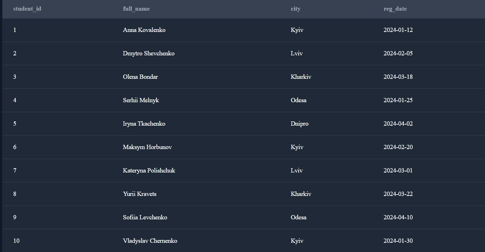
2. Вивести всі курси категорії `"Data Science"`.


## **Задача 2. Групування та агрегація**

1. Порахувати кількість студентів у кожному місті.
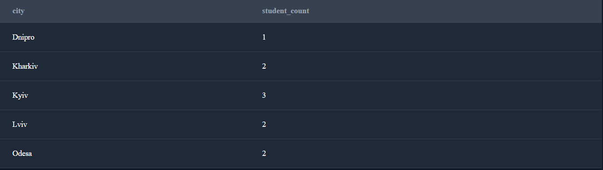
2. Порахувати кількість курсів у кожній категорії.
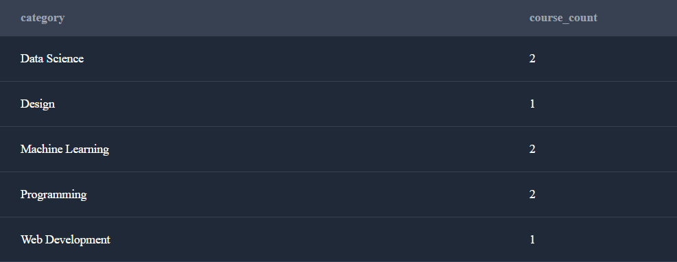
3. Порахувати середню оцінку по кожному курсу.


## **Задача 3. JOIN‑аналіз**

1. Вивести список курсів разом з іменами викладачів.
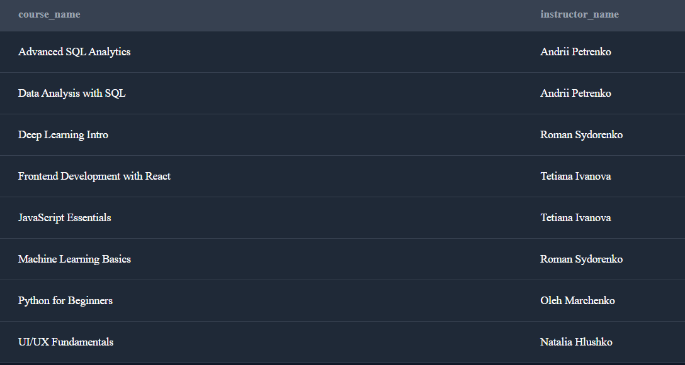
2. Вивести студентів та назви курсів, на які вони записані.
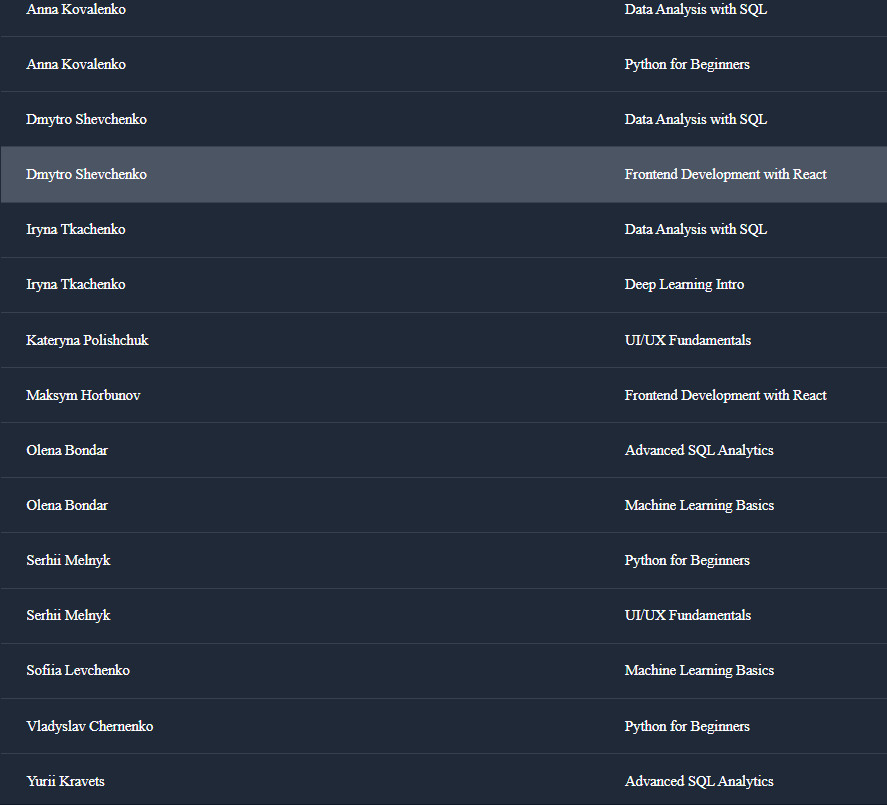
3. Порахувати, скільки студентів у кожного викладача.
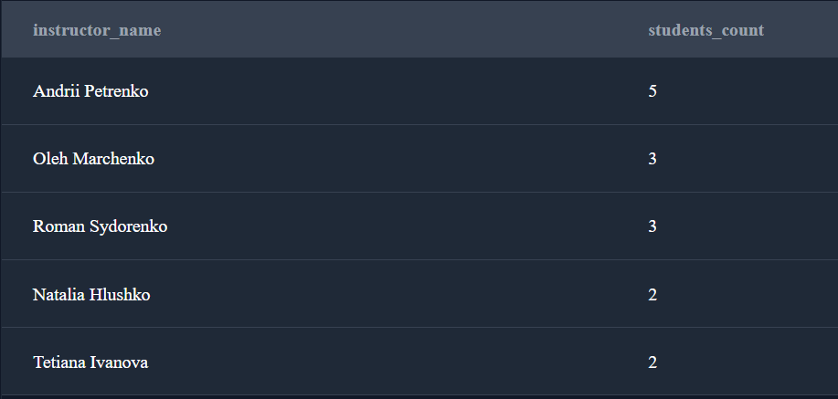

## **Задача 4. Аналітика прогресу**

1. Порахувати середню оцінку кожного студента.
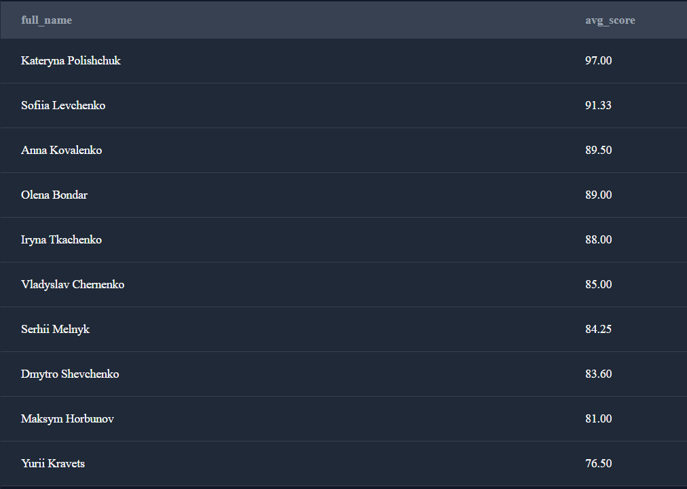
2. Порахувати відсоток завершених уроків для кожного курсу.
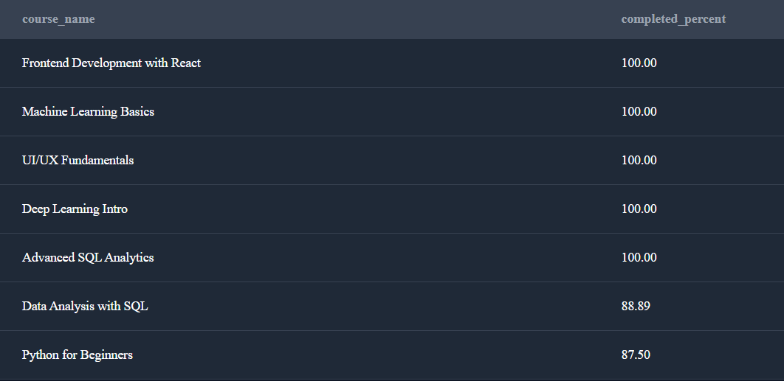
3. Знайти студентів, які завершили всі уроки у своїх курсах.
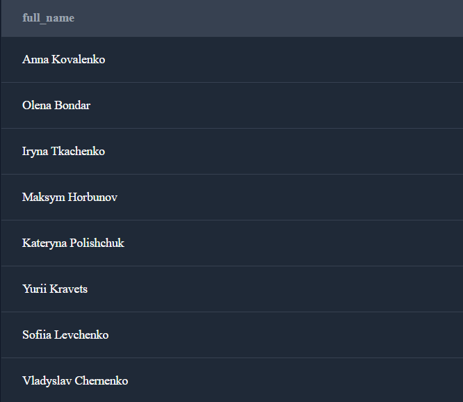

## **Задача 5. Віконні функції**

1. Для кожного курсу визначити рейтинг студентів за середнім балом.
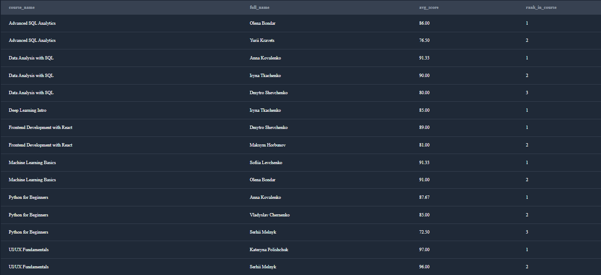
2. Порахувати кумулятивну кількість уроків, завершених студентом у хронологічному порядку.
    - *Покрокове виконання та пояснення*
        
        Нам потрібно порахувати **кумулятивну кількість уроків**, які завершив кожен студент, у хронологічному порядку. Це означає, що для кожного запису прогресу ми рахуємо загальну кількість завершених уроків від початку до поточного моменту.
        
        Нам треба таблиці:
        
        - `students` - щоб отримати інформацію про студентів
        - `enrollments` - щоб зв'язати студентів із курсами та отримати дату запису
        - `progress` - щоб отримати інформацію про завершені уроки
        
        ### **students**
        
        | Поле | Тип | Опис |
        | --- | --- | --- |
        | student_id | SERIAL PK | Унікальний ID студента |
        | full_name | TEXT | ПІБ |
        | city | TEXT | Місто |
        | reg_date | DATE | Дата реєстрації |
        
        ### **enrollments**
        
        | Поле | Тип | Опис |
        | --- | --- | --- |
        | enrollment_id | SERIAL PK | ID запису |
        | student_id | INT FK | Студент |
        | course_id | INT FK | Курс |
        | enroll_date | DATE | Дата запису |
        
        ### **progress**
        
        | Поле | Тип | Опис |
        | --- | --- | --- |
        | progress_id | SERIAL PK | ID прогресу |
        | enrollment_id | INT FK | Запис |
        | lesson_number | INT | Номер уроку |
        | score | NUMERIC | Оцінка |
        | completed | BOOLEAN | Чи завершено |
        
        Оскільки в таблиці `progress` немає поля з датою виконання уроку, ми використовуємо:
        
        - `enroll_date` з таблиці `enrollments` як базову дату
        - `lesson_number` як порядок виконання уроків всередині курсу
        
        Припускаємо, що уроки виконуються послідовно: урок 1, потім урок 2, потім урок 3 тощо.
        
        ### **Використання віконної функції**
        
        **SQL-запит (з заняття)**
        
        ```sql
        SELECT
            s.full_name,
            e.enroll_date,
            SUM(CASE WHEN p.completed THEN 1 ELSE 0 END)
                OVER (PARTITION BY s.student_id ORDER BY p.lesson_number) 
                AS cumulative_completed
        FROM students s
        JOIN enrollments e ON s.student_id = e.student_id
        JOIN progress p ON e.enrollment_id = p.enrollment_id
        ORDER BY s.student_id, e.enroll_date, p.lesson_number;
        ```
        
        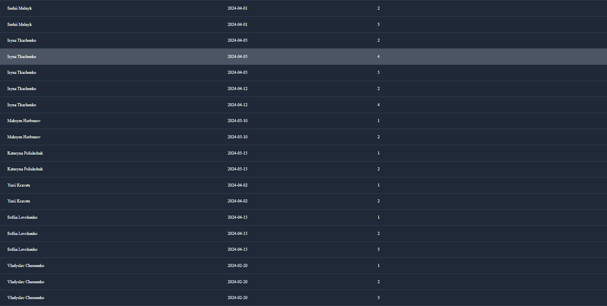
        Для підрахунку кумулятивної суми використовуємо віконну функцію `SUM() OVER()` з параметрами:
        
        - `PARTITION BY student_id` - розділяємо дані по кожному студенту окремо
        - `ORDER BY enroll_date, lesson_number` - сортуємо по даті запису на курс та номеру уроку
        - `ROWS BETWEEN UNBOUNDED PRECEDING AND CURRENT ROW` - рахуємо від початку до поточного рядка
        
        - **Інший, більш загальний, спосіб**
            
            **SQL-запит**
            
            ```sql
            -- Створюємо базовий SELECT із JOIN'ами
            SELECT 
                s.full_name,                     -- ПІБ студента
                e.enroll_date,
                
                -- Додаємо віконну функцію для кумулятивного підрахунку
                SUM(
                    CASE 
                        WHEN p.completed THEN 1          -- Якщо урок завершено, додаємо 1
                        ELSE 0                           -- Якщо не завершено, додаємо 0
                    END
                ) OVER (
                    PARTITION BY s.student_id           -- Окремо для кожного студента
                    ORDER BY e.enroll_date, p.lesson_number  -- У хронологічному порядку
                    ROWS BETWEEN UNBOUNDED PRECEDING AND CURRENT ROW  -- Від початку до поточного рядка
                ) AS cumulative_lessons_completed        -- Назва стовпця результату
            
            -- JOIN'имо всі необхідні таблиці
            FROM students s
            INNER JOIN enrollments e ON s.student_id = e.student_id
            INNER JOIN progress p ON e.enrollment_id = p.enrollment_id
            
            -- Сортуємо результат для зручності перегляду
            ORDER BY s.student_id, e.enroll_date, p.lesson_number;
            ```
            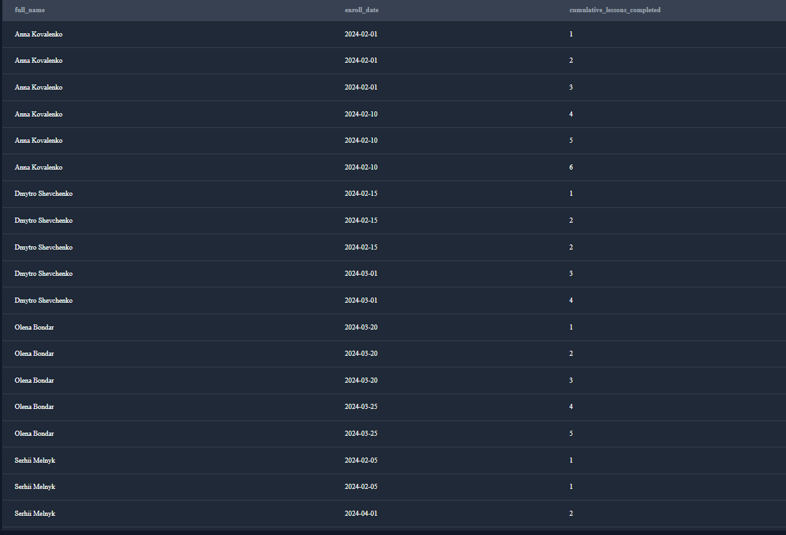
            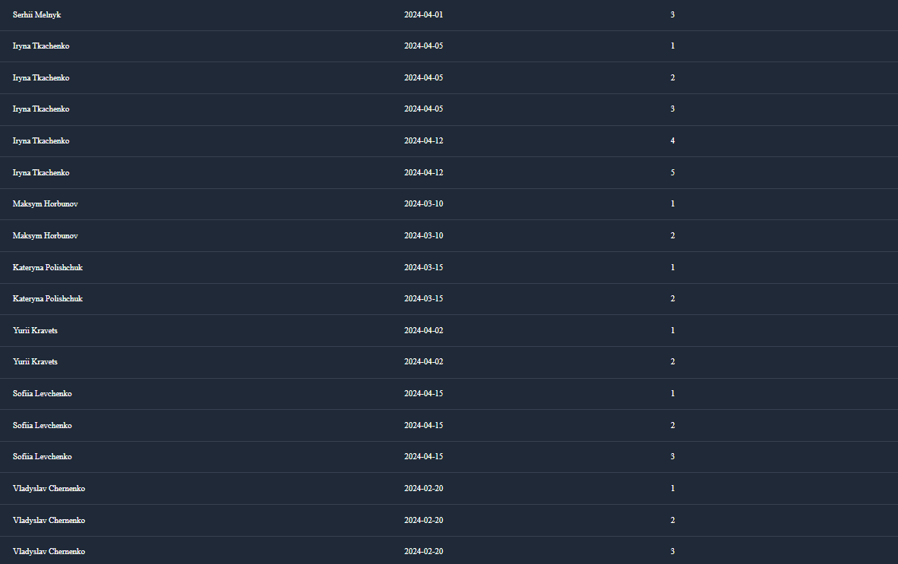
            > **ROWS BETWEEN UNBOUNDED PRECEDING AND CURRENT ROW**
            > 
            
            > Визначає "рамку вікна": від самого першого рядка (UNBOUNDED PRECEDING) до поточного рядка (CURRENT ROW). Це і є кумулятивний підрахунок.
            > 
        
        **Приклад результату**
        
        
        
        Додамо групування
        
3. Для кожної категорії курсів знайти топ‑1 курс за кількістю студентів.
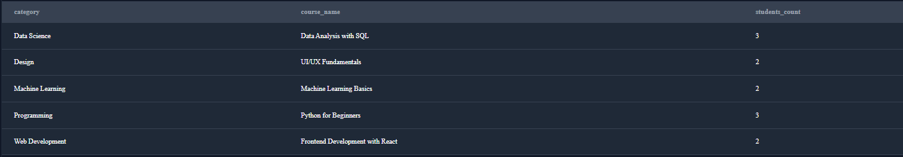


## 📌 Висновки по проєкту

## Загальний підсумок

У рамках даного проєкту було реалізовано комплексний аналіз даних онлайн-платформи для навчання з використанням SQL. Проєкт охоплює всі ключові аспекти роботи з реляційними базами даних: від базових запитів до аналітичних віконних функцій.

---

## Що було реалізовано

### 1️⃣ Робота з базовими запитами (SELECT, WHERE)

- Отримано списки студентів за датою реєстрації  
- Відібрано курси за категоріями  
- Реалізовано фільтрацію даних за умовами  

➡️ **Результат:** Закріплено навички базового аналізу та фільтрації даних

---

### 2️⃣ Агрегація та групування (GROUP BY, AVG, COUNT)

- Пораховано кількість студентів по містах  
- Пораховано кількість курсів по категоріях  
- Розраховано середні оцінки по кожному курсу  

➡️ **Результат:** Освоєно аналітичні запити для отримання бізнес-метрик

---

### 3️⃣ JOIN-аналіз між таблицями

- Зв’язано курси з викладачами  
- Отримано зв’язок студентів із курсами  
- Проаналізовано навантаження на викладачів  

➡️ **Результат:** Відпрацьовано роботу з кількома таблицями та реляційними зв’язками

---

### 4️⃣ Аналітика прогресу навчання

- Розраховано середню оцінку кожного студента  
- Проаналізовано відсоток завершених уроків по курсах  
- Виявлено студентів, які повністю завершили свої курси  

➡️ **Результат:** Отримано метрики ефективності навчання

---

### 5️⃣ Використання віконних функцій (WINDOW FUNCTIONS)

- Побудовано рейтинг студентів у межах кожного курсу  
- Реалізовано кумулятивний підрахунок завершених уроків  
- Визначено топ-курси в кожній категорії за кількістю студентів  

➡️ **Результат:** Освоєно просунуті аналітичні інструменти SQL

---

## Практична цінність проєкту

Проєкт моделює реальну аналітичну задачу з EdTech-сфери та демонструє здатність:

- Працювати з реляційною моделлю даних  
- Писати складні JOIN-запити  
- Отримувати бізнес-показники для прийняття рішень  
- Використовувати віконні функції для аналітики  

---

## Технології

- PostgreSQL-сумісний SQL  
- JOIN, GROUP BY, HAVING  
- Window Functions (RANK, SUM OVER)  
- Аналітичні запити  

---